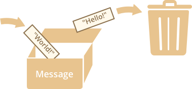

# Variables 

La mayoría de las veces, una aplicación JavaScript necesita trabajar con información. Dos ejemplos: 

1. Una tienda online - la información incluye los bienes que se venden y un carro de la compra 
2. Un chat - la información incluye usuario, mensajes y mucho más

En definitiva, las variables las utilizamos para almacenar información: 

## Una variable

Una variable es un "named storage" para los datos. Podemos utilizar una variable para almacenar cualquier dato. 

Para crear una variable en Js, usamos ``let``. 

A continuación, creamos una variable llamada mensaje:

```javascript
let mensaje; 
```

Ahora, podemos almacenar información a esa variable usando el = 

```javascript 
let mensaje; 
mensaje = 'Hola'; // almacena el string 'Hola'
```
El string ahora está guardado dentro de la memoria asociada a la variable. Podemos acceder usando el nombre de la variable. 

```javascript 
let mensaje;
mensaje = 'Hola'; 

alert(mensaje);
```
Podemos combiar estas dos líneas y ponerlas en una única línea 

```javascript 
let mensaje = 'Hola'; 
alert(mensaje); 
```
Podemos establecer varias variables en una única línea 

```javascript 
let user = 'John', age = 25, message = 'Hello';
```

Esto podemos hacerlo, pero no lo recomendamos, por temas de legibilidad. De lo contrario, podemos hacerlo en varias líneas: 

```javascript 
let user = 'John', 
    age = 25, 
    message = 'Hello';
```

También podremos observar la presencia del ``var`` en algún repositorio o proyecto. Este hace lo mismo que let, pero de una manera ligeramente diferente. Lo veremos próximamente. 

## Una anología 

Imaginemos la variable como una caja para los datos, con un único nombre dentro. 
Por ejemplo, la variable message puede ser imaginada como una caja llamada "message" con el valor de "Hello!" dentro de ella. 


Podemos poner cualquier valor dentro de la caja . 

Podemos cambiarla tantas veces como queramos: 

```javascript
let message; 

message = 'Hello"'; 

message = 'World'; // valor cambiado

alert (message);
```

Cuando cambiamos este valor, los antiguos datos son eliminados por la variable: 



También podemos declarar dos variables y copiar los datos de una dentro de otra: 

```javascript 

let hello = 'Hola Mundo'; 

let message; 

// copia "Hola Mundo" de la variable hello en message; 

message = hello; 

// ahora las dos variables almacenan los mismos datos 

alert(hello); 
alert(message); 
```

*Es interesante notar que los lenguajes de programación funcionales, como Scala Erlang, prohíben cambiar los valores de las variables. En estos idiomas, una vez que el valor se almacena "en la caja", está ahí para siempre. Si necesitamos almacenar algo más, el lenguaje nos obliga a crear una nueva caja (declarar una nueva variable). No podemos reutilizar el viejo. Aunque pueda parecer un poco extraño a primera vista, estos idiomas son muy capaces de desarrollarse seriamente. Más que eso, hay áreas como los cálculos paralelos donde esta limitación confiere ciertos beneficios. Se recomienda estudiar este tipo de lenguaje (incluso si no está planeando usarlo pronto) para ampliar la mente.*

Hay dos limitaciones a la hora de ponerle nombres a las variables: 

1. Ha de contener solo letras, digitos, o el simbolo $ o _ 
2. El primer caracter no puede ser un digito

Cuando la variable contiene varios nombres, camelCase es lo más usado. 

Es interesante saber que $ o _ son tratados como letras, por lo que:

```javascript 
let $ = 1; 
let _ = 2; 
```

son perfectamente váidos. 

Un ejemplo de variables mal escritas: 

```javascript 

let 1a; // cannot start with a digit

let my-name; // hyphens '-' aren't allowed in the name
```

**Case matters**: variables llamadas apple y AppLE son dos diferentes variables. 

**Non-English letters are allowed, but not recommended**: es posible utilizar cualquier lenguaje, no habiendo error alguno, pero existe una "tradicion" internacional para usar el inglés en el nombre de las variables. Esto se hace con la intención de que gente de otras culturas y páises lo puedan leer alguna vez. 

**Reserved names**: Hay una lista de palabras reservadas, las cuales no pueden ser usadads como variables porque las utiliza el lenguaje por sí mismo.

Por ejemplo: let, class, return y function son palabras reservadas. 

El código a continuación nos dan un error de sintaxis: 

```javascript
let let = 5; // can't name a variable "let", error! 
let return = 5; // also can't name it "return", error! 
```

**An assignment without use strict**: Normalmemente, necesitamos definir una variable antes de usuarla. Pero en los antiguos tiempos, tecnicamente era posible crear una variable por el mero asignamiento del valor sin necesidad de usar let. Esto sigue funcionando ahora sino podemos el 'use strict' en nuestros scripts para mantener la compatibilidad con los antiguos scripts. 

```javascript 
num = 5; // la varibale "num" ha sido creada si no existe 
alert(num); // 5
```

Esto es una mala práctica, y causará un error si lo utilizamos en modo estricto: 

```javascript 
num = 5; // error: num is not defined 
```

## Variables constantes 

Para declarar una constante variable, usaremos ``const `` en vez de ``let``: 

```javascript 
const myBirthday = "18.04.1982"; 
```

Las variables declaradas usando ``const`` son conocidas como "constantes". **No pueden ser cambiadas**. Cambiarlas supondría un error. 

```javascript 
const myBirthday = '18.04.1982';

myBirthday = '01.01.2001'; // error, can't reassign the constant!
```

Cuando un programador está seguro de que una variable nunca va a cambiar, lo podemos declarar como const para garantizar y comunicar este hecho a todo el mundo. 

